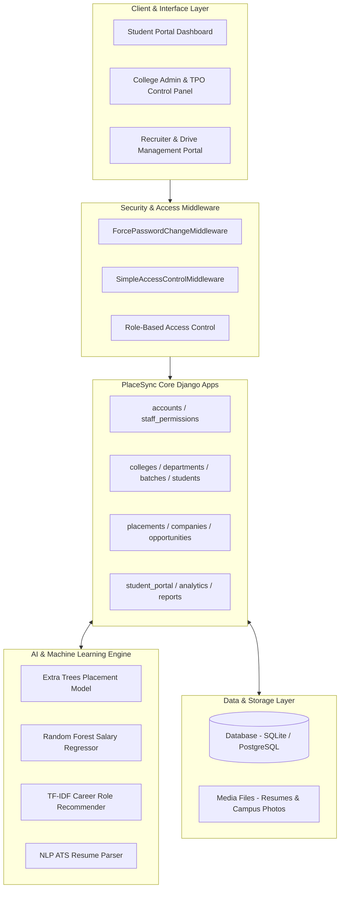

# 🚀 PlaceSync — Smart University Placement Management & AI Career Intelligence Platform

[](https://www.python.org/)
[](https://www.djangoproject.com/)
[](https://scikit-learn.org/)
[]()
[]()

> **PlaceSync** is an enterprise-grade, multi-tenant University Placement Management System powered by Machine Learning and AI Career Intelligence. It seamlessly connects **Students**, **College Administrators & TPOs**, and **Corporate Recruiters** to streamline the entire campus hiring ecosystem—from automated bulk student onboarding and eligibility filtering to live ATS resume parsing, placement probability forecasting, and real-time recruitment analytics.

---

## 🌟 Executive Highlights

* 🤖 **ATS Resume Intelligence Engine**: Built-in digital PDF parser that analyzes candidate resumes, calculates keyword density, scores ATS compatibility (0-100%), and provides side-by-side resume version comparison.
* 📈 **Machine Learning Placement Predictor**: Employs an *Extra Trees Classifier* (`placement_model.pkl`) to evaluate student CGPA, backlogs, coding scores, and practical projects to forecast campus placement probability.
* 💰 **ML Salary Forecast Package**: Uses a *Random Forest Regressor* (`salary_model.pkl`) to predict fresher CTC package expectations in LPA tailored to student skill profiles.
* 🎯 **AI Career Role Recommender**: Utilizes *TF-IDF Vectorization* & *Nearest Neighbors* (`career_recommendation_model.pkl`) to match student skills against industry job matrix benchmarks.
* ⚡ **Bulk Student CSV/Excel Importer**: Robust data ingestion engine supporting roll numbers in scientific notation, large integer roll numbers (e.g., `24002170210063`), and flexible column headers.
* 🏢 **Multi-College & Department Management**: Complete multi-tenant architecture supporting multiple universities, colleges, departments, and batch cohorts.

---

## 📐 System Architecture



---

## ✨ Key Features & Capability Matrix

### 👨‍🎓 1. Student Career Intelligence Portal
* **Real-Time Readiness Dashboard**: Displays Placement Readiness Index (%), ML Salary Forecast (LPA), ATS Quality Index, and shortlists count at a glance.
* **Resume Management & Comparison**: Upload multiple resume versions, select a primary CV, and run side-by-side A/B resume score evaluations.
* **Skills & Project Portfolio**: Categorized skill inventory (Languages, Frameworks, Databases, Tools), project showcases, certificates, and hackathon journals.
* **Daily Missions & Achievements**: Micro-goal tracker to incentivize profile completion and skill building.
* **Drive Discovery & Applications**: One-click application to eligible college placement drives with deadline tracking.

### 🏛️ 2. College Admin & Placement Officer (TPO) Suite
* **Batch & Student Directory**: Searchable, paginated student listings with filtering by batch, department, CGPA, and placement status.
* **Bulk Student Onboarding**: Import hundreds of student profiles via CSV/Excel with automatic password generation and error validation.
* **Drive & Recruiter Management**: Post placement drives with configurable eligibility filters (min CGPA, backlog caps, eligible branches).
* **Multi-College Data Isolation**: Complete data segregation for college administrators managing their respective institutions.
* **Campus Media Management**: Upload and manage multi-photo campus galleries with support for `.jpg`, `.png`, and `.jfif` image formats.

### 🤖 3. AI / Machine Learning Engine
| ML Service | Algorithm / Model | Artifact File | Functionality |
| :--- | :--- | :--- | :--- |
| **Placement Probability** | Extra Trees Classifier | `placement_model.pkl` | Predicts candidate placement probability (0-100%) and readiness tier. |
| **Salary Forecasting** | Random Forest Regressor | `salary_model.pkl` | Predicts fresher CTC package range in LPA based on skill & academic profile. |
| **Career Role Recommendation** | TF-IDF + Nearest Neighbors | `career_recommendation_model.pkl` | Recommends top job roles matching candidate technical terms. |
| **ATS Resume Scoring** | Rule-Based NLP & Parser | Built-in Python Engine | Extracts text from PDF, detects section headers, and scores keyword density. |

---

## 🛠️ Technology Stack

* **Backend Framework**: Python 3.11+ & Django 4.2.30
* **Machine Learning & Data Science**: Scikit-Learn, NumPy, Pandas, Joblib, NLTK
* **Database**: SQLite3 (Development) / PostgreSQL (Production Compatible)
* **Frontend Design**: HTML5, Vanilla CSS3 (Tailored Design Tokens & Glassmorphism), JavaScript (ES6+), Google Fonts (*Space Grotesk*, *Inter*)
* **Document & Image Processing**: PyPDF2, Pillow (`PIL`), OpenPyXL
* **Security Middleware**: Django Session Authentication, CSRF Protection, Custom Access Control & Password Reset Middleware

---

## 📁 Workspace & App Directory Structure

```
PlaceSync/
├── PlaceSync/              # Root Django configuration (settings, urls, wsgi)
├── accounts/               # Custom user model, login flows, and middleware
├── analytics/              # ML model loaders and prediction pipelines
├── batches/                # Batch management and bulk student CSV import engine
├── colleges/               # College profile, campus images, and administration
├── communication/          # Email notifications and template dispatch
├── companies/              # Recruiter and corporate partner database
├── departments/            # Department and branch hierarchy
├── dataset/                # Trained ML pickle artifacts and raw datasets
│   ├── trained_models/     # placement_model.pkl, salary_model.pkl, etc.
│   └── raw/                # Historical placement & resume datasets
├── opportunities/          # Off-campus placement opportunity scrapers
├── placements/             # Drives, applications, bookmarks, and calendar events
├── reports/                # Export engine for PDF and Excel placement reports
├── staff_permissions/      # Fine-grained staff permission checks
├── student_portal/         # Student portal views, ATS analyzer, and forms
├── students/               # StudentProfile, StudentSkill, Project, StudentResume models
├── templates/              # HTML5 templates grouped by app domain
├── static/                 # CSS stylesheets, JS scripts, and brand assets
└── manage.py               # Django CLI management script
```

---

## ⚙️ Local Development & Quickstart Guide

### Prerequisites
* **Python 3.11+** installed on your system.
* **pip** (Python package manager).

### 1. Clone the Repository
```bash
git clone https://github.com/your-username/PlaceSync.git
cd PlaceSync
```

### 2. Create and Activate a Virtual Environment
* **Windows (PowerShell)**:
  ```powershell
  python -m venv venv
  .\venv\Scripts\Activate.ps1
  ```
* **Linux / macOS**:
  ```bash
  python3 -m venv venv
  source venv/bin/activate
  ```

### 3. Install Dependencies
```bash
pip install -r requirements.txt
```
*(If `requirements.txt` is missing, install the core dependencies)*:
```bash
pip install django scikit-learn pandas numpy joblib pypdf2 openpyxl pillow
```

### 4. Run Database Migrations
```bash
python manage.py migrate
```

### 5. Start the Development Server
```bash
python manage.py runserver
```

Open your browser and navigate to: **`http://127.0.0.1:8000/`**

---

## 🧪 Running Automated Unit Tests

PlaceSync includes comprehensive Django unit tests covering authentication, CSV bulk imports, image uploads, middleware execution, and portal views.

To run the complete test suite:
```bash
python manage.py test
```

---

## 🔐 Demo User Accounts & Access Roles

| Role | Username | Password | Purpose |
| :--- | :--- | :--- | :--- |
| **Super Admin** | `admin` | `admin123` | Full system access & database management. |
| **College Admin (LJIET)** | `admin_ljiet` | `admin123` | Institutional admin for L J Institute of Engineering & Technology. |
| **Student Account** | `IT24002170210063` | *(First login password flow)* | Student career intelligence portal (Kavya). |

---

## 📄 License & Attribution

This project is licensed under the **MIT License** — feel free to customize and expand it for your institution or organization.

Created with ❤️ by the **PlaceSync Development Team**.
